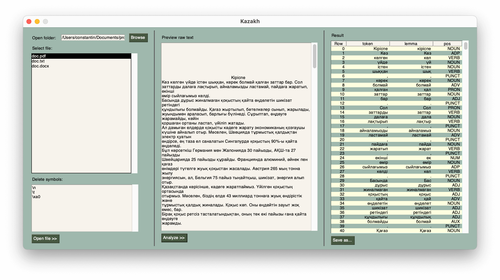

# Анализ частей речи для казахского языка.  
Десктопное приложение, анализирует pdf, docx, txt файлы с помощью [udPipe](https://lindat.mff.cuni.cz/services/udpipe/).  
  

## Build app  
```bash
pyinstaller --noconsole --clean --name kazakh_pos --collect-all "spacy_udpipe" --add-data "./kazakh-ud-2.0-170801.udpipe;." app.py
```
  
